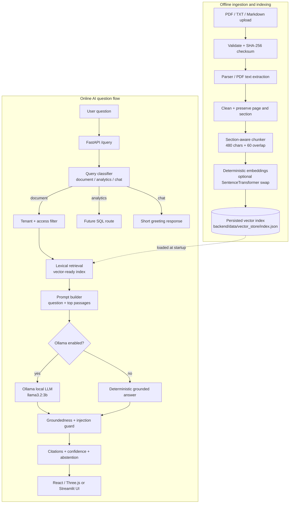

# SHAGARA AI Architecture

## What counts as AI

1. The notebook creates embeddings for each chunk and persists them with metadata.
2. FastAPI loads the persisted index once at startup.
3. Retrieval selects the relevant garden passages after tenant and access filtering.
4. The prompt builder gives only those passages to the generator.
5. With `use_ollama=true`, Ollama runs the local `llama3.2:3b` model.
6. Without Ollama, the deterministic grounded fallback keeps the demo runnable offline.
7. The response includes evidence, confidence, abstention, and safety flags.

The fallback is deliberate: it makes the product demonstrable even when Ollama is not installed, while the real local LLM path is available for the submitted AI demo.

