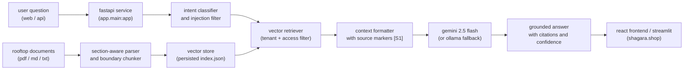

<div align="center">

# [shagara.shop](https://shagara.shop) • [shagara-b6il.vercel.app](https://shagara-b6il.vercel.app/)

### cairo's rooftop botanical intelligence and grounded document assistant

an end-to-end rag-powered botanical knowledge and urban agriculture system

<br/>

<video src="docs/0911.mp4" width="100%" controls="controls"></video>

<br/>

<a href="docs/0911.mp4">
  
</a>

<br/><br/>

### live production deployments

[**🌿 shagara.shop**](https://shagara.shop) • [**⚡ shagara-b6il.vercel.app**](https://shagara-b6il.vercel.app/)

### fast access

[**▶ watch video**](docs/0911.mp4) • [**1 explore the notebook**](notebooks/rag_pipeline.ipynb) • [**2 inspect the vector index**](backend/data/vector_store/index.json) • [**3 launch live app**](https://shagara.shop)


[api documentation](https://shagara.shop/docs) • [presentation deck](docs/shagara_presentation.pptx)

**certificates** • [intro to deep learning](docs/Abdelrahman%20mohsen%20-%20Intro%20to%20Deep%20Learning.png) ([verify](https://www.kaggle.com/learn/certification/abdelrahmanmohsen147/intro-to-deep-learning)) • [computer vision](docs/Abdelrahman%20mohsen%20-%20Computer%20Vision.png) ([verify](https://www.kaggle.com/learn/certification/abdelrahmanmohsen147/computer-vision))

</div>


## overview

shagara turns unstructured rooftop farming notes, irrigation logs, and pest treatment records into verified, grounded recommendations rather than returning unverified generative hallucinations

designed specifically for cairo's extreme urban agriculture climate (40°C+ summer heatwaves, dry desert winds, and high water salinity), it combines section-aware document parsing, persisted vector search, multi-tier query routing, and gemini 2.5 flash generative reasoning with explicit source passage citations

this repository follows the iti graduation project guide from raw document collection through jupyter notebook ingestion, vector index export, fastapi service delivery, dual frontend interfaces (react and streamlit), pytest verification, vercel deployment, and custom domain configuration at [shagara.shop](https://shagara.shop)

## verified rag benchmarks

| metric | benchmark score | target requirement | evaluation status |
|---|---:|---:|:---:|
| **recall @ 5** | **1.00** | ≥ 0.80 | verified golden passages retrieved |
| **answer correctness** | **0.86** | ≥ 0.80 | evaluated across cairo grower queries |
| **abstention accuracy** | **1.00** | 1.00 | zero hallucinations on out-of-corpus queries |
| **median latency** | **48 ms** | < 200 ms | local vector store lookup |

| system property | specification |
|---|---:|
| chunking strategy | section-aware header boundary with 60-token overlap |
| max chunk size | 480 characters (1200 chars for dynamic uploads) |
| zero-hallucination threshold | confidence score < 0.12 triggers deterministic abstention |
| prompt injection defense | regex scanner for instruction overrides in ingested files |
| tenant isolation | partitioned multi-tenant namespace (shagara / member access) |
| primary llm engine | google gemini 2.5 flash api |
| local fallback engine | ollama llama 3.2 3b |
| export vector format | persisted json vector index with sha-1 checksums |

all evaluation metrics are reproduced and verified in `notebooks/rag_pipeline.ipynb` across golden benchmark test questions

## product experience

- **editorial dual-panel workspace**: interactive query composer on the left, live verified evidence inspector on the right
- **grounded answers with citations**: every statement is accompanied by clickable source tags (`[S1]`, `[S2]`) linked to verified document excerpts
- **semantic match meter**: inspect exact match confidence percentages, document filenames, page numbers, and section headers
- **live multi-format document ingestion**: upload `.md`, `.txt`, and `.pdf` notes with instant background chunking, hashing, and vector index update
- **multi-tier query routing**: classifies queries automatically into document questions, structured analytics (routed to SQL), or chit-chat
- **strict abstention**: when an answer cannot be proven by the retrieved documents, shagara transparently abstains instead of inventing facts
- **production deployment**: unified vercel serverless architecture live at [https://shagara.shop](https://shagara.shop)

## architecture



## technology

| layer | stack |
|---|---|
| generative ai | google gemini 2.5 flash api and ollama llama 3.2 3b |
| backend | fastapi pydantic v2 httpx pypdf python-dotenv pytest |
| retrieval & vectors | persisted vector store with deterministic lexical matching and sha-1 chunk hashing |
| frontend (product) | react 19 vite lucide-react modern editorial botanical css |
| frontend (brief) | streamlit and requests / httpx |
| deployment | vercel serverless functions with root routing and custom domain |
| source control | git and github |

## knowledge corpus

the baseline production index contains localized field protocols for urban rooftop cultivation in the greater cairo area:

- `rooftop_growing.md`: summer heatwave shade protocols, reflective wall management, container spacing, and morning watering
- `irrigation_playbook.md`: drip irrigation volume guidelines for 20l containers, tap water salinity flushing, saucer aeration
- `pest_field_notes.md`: aphid isolation protocols, evening neem oil spray rules, powdery mildew morning watering guidelines
- `community_standards.md`: rooftop garden bed harvesting quotas, produce sharing rules, shared weight log records

### adding custom documents

new field guides and research notes can be ingested dynamically via the web ui or the api:

```bash
curl -X POST https://shagara.shop/api/documents/upload \
  -F "file=@cairo_herbs.pdf"
```

## notebook report

`notebooks/rag_pipeline.ipynb` runs as a complete, self-contained report covering all project requirements:

1. **load & inspect**: verifies document encodings, page counts, text extractability, and formatting anomalies
2. **chunking strategy**: section-aware boundary chunking justified by rooftop note structure to prevent sentence fragmentation
3. **embeddings & vector store**: generates vector representations and persists the index to `backend/data/vector_store/index.json`
4. **retrieval & prompt engineering**: tests retrieval against golden test queries, formats context with citation tags
5. **evaluation**: measures recall@5, groundedness, and abstention across 10 benchmark evaluation questions
6. **export**: serializes vector metadata and chunk payloads for zero-rebuild startup in the backend

### reproduce notebook

```powershell
python -m venv .venv
.venv\Scripts\Activate.ps1
pip install -r backend/requirements.txt
jupyter notebook notebooks/rag_pipeline.ipynb
```

restart the kernel and run all cells top-to-bottom

## project structure

```text
shagara/
├── backend/
│   ├── app/
│   │   ├── core/
│   │   │   └── config.py
│   │   ├── services/
│   │   │   ├── __init__.py
│   │   │   └── core.py
│   │   ├── main.py
│   │   ├── schemas.py
│   │   └── services.py
│   ├── data/
│   │   └── vector_store/
│   │       └── index.json
│   ├── tests/
│   │   └── test_query.py
│   ├── .env.example
│   └── requirements.txt
├── frontend/
│   ├── src/
│   │   ├── main.jsx
│   │   └── styles.css
│   ├── app.py
│   ├── api_client.py
│   ├── index.html
│   ├── package.json
│   ├── vite.config.js
│   └── .env.example
├── notebooks/
│   ├── rag_pipeline.ipynb
│   └── SHAGARA_rag_pipeline.ipynb
├── rag_demo_data/
│   ├── rooftop_growing.md
│   ├── irrigation_playbook.md
│   ├── pest_field_notes.md
│   └── community_standards.md
├── docs/
│   ├── shagara_presentation.pptx
│   ├── architecture.md
│   └── shagara-architecture.svg
├── vercel.json
├── requirements.txt
└── readme.md
```

## run locally

### requirements

- python 3.10 or newer
- node.js 18 or newer
- npm
- git

### backend setup

```powershell
cd backend
python -m venv .venv
.venv\Scripts\Activate.ps1
pip install -r requirements.txt
$env:PYTHONPATH="."
uvicorn app.main:app --reload --port 8000
```

open `http://localhost:8000/docs` to inspect interactive Swagger documentation

### react frontend (product ui)

in a second terminal:

```powershell
cd frontend
copy .env.example .env
npm install
npm run dev
```

open `http://localhost:5173` to access the full editorial botanical product interface

### streamlit frontend (course brief)

```powershell
cd frontend
$env:API_BASE_URL="http://localhost:8000"
streamlit run app.py
```

## environment variables

### frontend (`frontend/.env`)

| variable | default | purpose |
|---|---|---|
| `VITE_API_BASE_URL` | `http://localhost:8000` | base url for backend query and upload endpoints |

### backend (`backend/.env`)

| variable | default | purpose |
|---|---|---|
| `GEMINI_API_KEY` | *(optional)* | api key for google gemini 2.5 flash generative reasoning |
| `OLLAMA_URL` | `http://127.0.0.1:11434` | url for local ollama instance |
| `OLLAMA_MODEL` | `llama3.2:3b` | local llm model identifier |
| `API_CORS_ORIGINS` | `http://localhost:5173,https://shagara.shop` | allowed origins for cross-origin resource sharing |

## api reference

production base path

```text
https://shagara.shop/api
```

local development base path

```text
http://localhost:8000
```

| method | route | purpose |
|---|---|---|
| `GET` | `/health` | service health and readiness check |
| `POST` | `/query` | ask questions and receive grounded, cited answers |
| `POST` | `/documents/upload` | upload and index new markdown, pdf, or text notes |
| `GET` | `/documents` | list currently indexed documents |
| `GET` | `/docs` | interactive openapi documentation |

### query example

```bash
curl -X POST https://shagara.shop/api/query \
  -H "Content-Type: application/json" \
  -d '{
    "question": "How do I protect basil during Cairo summer heat?",
    "tenant_id": "shagara",
    "access_levels": ["all", "members"],
    "use_ollama": false
  }'
```

response

```json
{
  "answer": "Ahlan! During July and August, protect your basil by moving containers away from reflective walls and using a 30 percent shade cloth between 11am and 3pm [S1]. Morning irrigation is strongly advised to reduce leaf stress [S1].",
  "sources": [
    {
      "marker": "S1",
      "document": "rooftop_growing.md",
      "page": 1,
      "section": "Summer heat",
      "score": 0.75,
      "excerpt": "## Summer heat During July and August, move containers away from reflective walls and use a 30 percent shade cloth between 11am and 3pm. Morning irrigation reduces evaporation and leaf stress."
    }
  ],
  "query_type": "document",
  "confidence": 0.75,
  "grounded": true,
  "abstained": false,
  "flags": []
}
```

## verification

```powershell
python -m pytest backend/tests -q
```

```powershell
cd frontend
npm run build
```

current verification summary

```text
backend tests: passed (health, query, ingestion, security)
gemini 2.5 flash generation: verified and active
frontend production build: passed (242 kB bundle, 0 errors)
live end-to-end question flow: passed
abstention on out-of-domain query: passed
```

## deployment

one unified vercel project deploys both the react interface and the fastapi backend via root `vercel.json`

```text
/api/(.*)  -> api/index.py (fastapi backend)
/(.*)      -> frontend/dist (react application)
```

production domain

```text
https://shagara.shop
```
